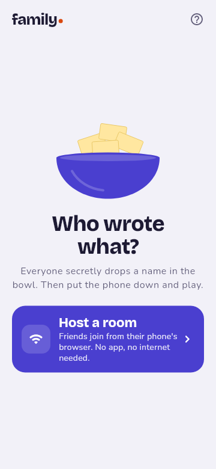
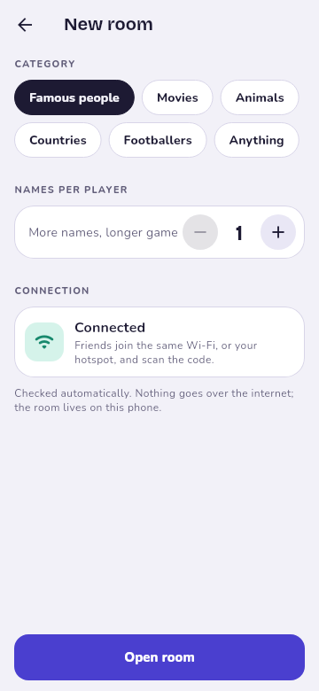
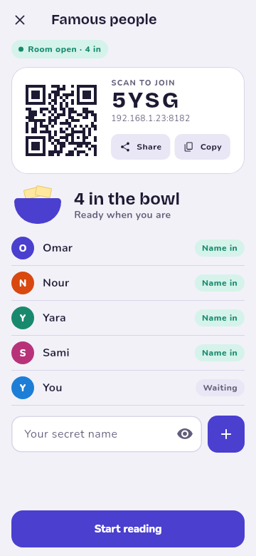
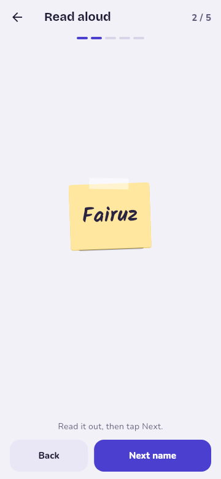
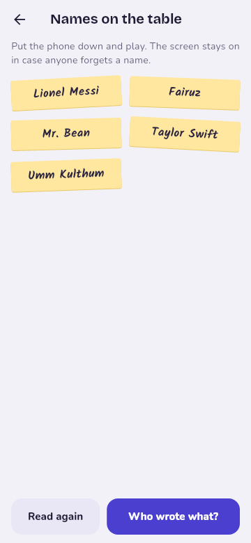
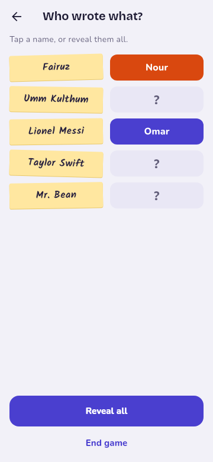
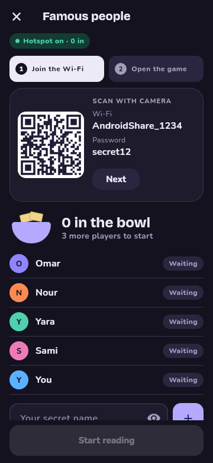
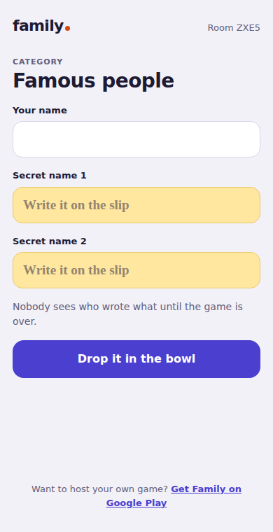

# Family Game

A party game for the living room. Everyone secretly drops a name in the bowl, the host reads them out, and then the phone goes down on the table while you play: ask "Did you write …?", and whoever you catch joins your family. The last family standing wins.

The host's phone runs the room. Friends join from their phone's browser by scanning a QR code, so they don't need the app, and no internet is needed.

| Home | New room | Lobby | Read aloud |
|---|---|---|---|
|  |  |  |  |

| Names on the table | Who wrote what? | No Wi-Fi: app hotspot | Friend's phone |
|---|---|---|---|
|  |  |  |  |

| عربي مصري: Home | عربي مصري: Lobby |
|---|---|
|  |  |

The app speaks English and Egyptian Arabic (right to left). It follows the phone's language, and the settings on the home screen switch it. Friends' join pages follow their own phone's language.

## How a game goes

1. **Host a room.** Set your name once (it's remembered), pick one of 14 categories or type your own, choose how many names each player writes, and whether the same name may go in twice.
2. **Friends join.** They scan the QR code and type their name and their secret name(s). The host sees who has joined, never what they wrote.
   - **On Wi-Fi:** one QR code with the game link.
   - **No Wi-Fi (Android 8+):** tap **Create hotspot**. Code 1 joins the hotspot with the camera, code 2 opens the game.
   - **iPhone host, no Wi-Fi:** turn on Personal Hotspot in Settings and come back. The app picks it up.
3. **Read aloud.** One slip at a time, in random order. Read them once or twice.
4. **Names on the table.** The list stays on screen (the screen stays awake) in case anyone forgets a name. Play at the table.
5. **Who wrote what?** Optional, after the game: each slip flips to show who wrote it. Then start a new round in the same room.

## Face-off mode

Pick **Face-off** (فريق قصاد فريق) when opening a room. Everyone writes names as usual, then:

1. **Teams.** 2–4 teams of at least 2, made one of three ways: the app shuffles (with Reshuffle), friends pick on the join page, or the host taps players to move them.
2. **Turns.** Everyone writes 3 names by default (up to 5). The app draws a name written by someone on another team. The team on turn talks it over and picks who wrote it, while the other team keeps a straight face. After a drumroll the app says only right (+1) or wrong; who wrote what stays secret until the end.
3. **Bet double.** A team that's sure can bet double: +2 if right, −1 if wrong.
4. **One pass through the bowl.** Each name comes out once; when the bowl is empty the game ends.
5. **Results** with confetti and every writer revealed. *Share this night* makes a picture of the scores for the family group; the classic mode's *Who wrote what?* has one too.

## Family online mode

Pick **Family online** when opening a room to play the classic game with the app as referee. Everyone writes names as usual, then plays on their own phone (friends in the browser, the host in the app):

1. **Everyone starts as their own family.** A random player goes first. On your family's turn, the head picks anyone outside the family and types a name from memory: "did you write …?". Only names already caught show on the board, so nobody reads the list off a phone (in a handwritten room the drawings are picked instead).
2. **Right**, and that person's whole family joins yours and you ask again. **Wrong**, and the turn passes to the family of the person you asked. The last family standing wins.
3. **Family ideas.** Members suggest guesses and vote for them; the head can pick one with *Use*. There's no chat, so the game keeps moving.
4. **Two winners:** the family that grew to take everyone in, and its head, the one person nobody caught.
5. A host who put no name in watches the board, and so does anyone who arrives after the start.
6. **Awards of the night** at the end (أسوأ كداب, وش البوكر, أكتر واحد اتظلم, المخبر) and a **family tree** of who caught whom, on the screen and in the share picture.

**House rules** (switches when opening the room, all off by default):
- **Secret catches (مسكة في السر):** only your family sees your ask's result; caught people secretly join you and keep acting free. Turns go round every player. Everything is revealed at the end.
- **Rumors (إشاعة):** once a game, spread an anonymous true-or-false rumor to every phone.
- **"فكّك مني!":** one card goes round the game (hot potato). Whoever holds it can cancel an ask on them: nobody learns if it was right, the asker loses the turn and gets the card.

**Other room options:** *Write by hand (بخط إيدك)* has everyone draw their names with a finger, and the scribbles are what everyone sees. *Sound effects* (in settings) plays a drumroll, a zaghrouta and a sad trombone; friends' pages have their own mute button.

## Running it

Requires Flutter 3.44 (Dart 3.12).

```sh
flutter pub get
flutter run
```

Checks:

```sh
flutter analyze
flutter test
```

The tests cover the game rules, the HTTP host (including HTML escaping and the closed-bowl rules), both state holders, and every screen at 360×800 and 800×360 in left-to-right and right-to-left.

### Release signing

`android/app/build.gradle.kts` signs release builds with `android/key.properties` when that file exists (it is git-ignored), as in the [Flutter deployment guide](https://docs.flutter.dev/deployment/android#configure-signing-in-gradle):

```properties
storePassword=…
keyPassword=…
keyAlias=…
storeFile=/path/to/upload-keystore.jks
```

Without it, release builds fall back to the debug key.

## How it's built

Feature-first layout with cubits (`flutter_bloc`) for state:

```
lib/
├── main.dart, app.dart            # wiring: real network + HTTP host, theme, routes
├── core/
│   ├── theme/                     # light and dark ColorSchemes, GameColors extension
│   ├── motion/                    # durations, curves, shared-axis transitions
│   ├── platform/haptics.dart
│   ├── router/app_router.dart
│   └── widgets/                   # Bowl, KeepScreenOn, PlayerAvatar, ShareCard
└── features/
    ├── room/                      # hosting: new room + lobby
    │   ├── domain/                # Room rules, RoomHost and NetworkAccess contracts
    │   ├── data/                  # LanRoomHost (HTTP server), JoinPage (HTML), DeviceNetwork
    │   └── presentation/          # RoomCubit, home / new room / lobby screens
    ├── round/                     # classic: read aloud, names on the table, who wrote what
    ├── celebrity/                 # face-off: teams, who-wrote-it guesses, bets, results
    ├── family/                    # family online: rules, the host's seat and board
    └── settings/                  # host name and language, saved on the phone
        ├── round_route.dart       # RoundArgs / RoundExit: what the lobby hands over
        └── presentation/          # RoundCubit and screens
android/app/src/main/kotlin/…/LocalHotspot.kt   # Android local-only hotspot bridge
```

- **Room hosting.** The server listens on every IPv4 interface on port 8182, falling back to any free port. It keeps working when the phone moves between Wi-Fi, its own hotspot and the app's hotspot; only the address shown in the QR code changes. Each friend gets a random id cookie, so they can edit their slip until reading starts.
- **Hotspot.** Android's `LocalOnlyHotspot`. It needs the Nearby devices permission on Android 13+, and Location on Android 8–12 (location itself is never read).
- **Motion.** The big moments get the drama; play itself stays calm.
  - **Lobby:** a slip drops into the bowl and a "Lina's name is in" banner pops up in her colour. When enough players are in, the bowl wobbles and Start pulses.
  - **Start reading:** the bowl shakes and blank slips fly out into a deck (tap to skip). Then each name flips over.
  - **Who wrote what:** each card shrinks and wobbles, flips, and lands in the writer's colour. The last one sets off confetti.
  - **Friend's phone:** their slip drops into a bowl with confetti, and when reading starts the page flashes and buzzes so they look up.
  - **Everywhere:** Material 3 easing and shared-axis transitions. Everything turns off with the system "remove animations" setting. There is no sound.
- **Fonts** (bundled, so they work offline): Bricolage Grotesque, Nunito and Kalam, under the SIL Open Font License (`assets/fonts/OFL-*.txt`, also listed on the app's licences page).
